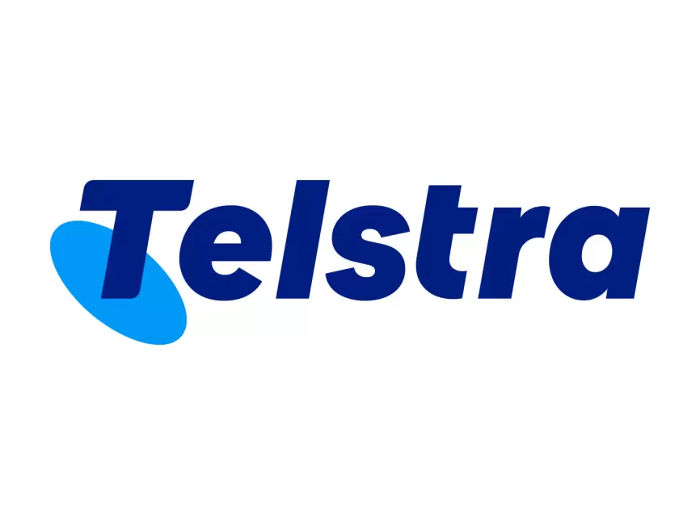

# Fatima Muhammad

Computer Science student focused on Security Operations, Blue team work, detection engineering, and defensive automation.

My work centers on building hands-on lab environments to simulate security events, analyze endpoint behavior, investigate logs, and develop scripting tools that support incident response and monitoring workflows. I am particularly interested in SOC operations, network security, incident response, digital forensics and cloud security.

---

## Core Focus

- Security Operations (SOC)
- Network Security
- Digital Forensics
- Endpoint Monitoring & Detection
- Log Analysis & Event Correlation
- Incident Response Documentation
- PowerShell & Bash Security Automation
- Cloud Security 

---

## Technical Environment

### Operating Systems
- Windows 10 / 11 (Event Logs, Defender, Firewall, RDP, Security)
- Linux (Kali)

### Scripting & Automation
- PowerShell (log parsing, process monitoring, system inspection, automation)
- Bash (log analysis, authentication monitoring)
- Python (security tooling & automation)

### Security & Networking Tools
- Wireshark
- Nmap
- Splunk
- Suricata
- SIEM & SOAR Tools
- Windows Event Viewer
- Microsoft Defender
- VirtualBox
- TryHackMe Labs
- Over the wire Labs

---

## Selected Work

### Project 01 - Metasploit Attack Simulation & Endpoint Detection Lab
End-to-end attack lifecycle simulation using Kali Linux and Windows 11, followed by Sysmon telemetry ingestion and detection analysis in Splunk.

**Focus Areas:**
- Reverse TCP payload generation (msfvenom)
- Meterpreter session handling
- Network enumeration (Nmap)
- Endpoint telemetry collection (Sysmon)
- SIEM ingestion & investigation (Splunk)
- MITRE ATT&CK mapping

View Project Repository: https://github.com/FatimaLearnsCyber/Kali-Windows-Metasploit-Detection-Lab

### [Project 02 – Title Placeholder]
Brief description of the project.

### [Project 03 – Title Placeholder]
Brief description of the project.

### [Project 04 – Title Placeholder]
Brief description of the project.

---

## Lab & Research Areas

- Reverse connection behavior analysis in controlled VM environments  
- Attacking and Defending Systems
- Windows Defender behavioral detection observations  
- Firewall configuration testing and RDP monitoring  
- Event ID analysis for suspicious activity detection  
- Log-based brute-force detection using Bash  
- Cloud logging and identity configuration reviews  

---

## Certifications

<table>
<tr>

<td align="center" width="80">
<a href="https://www.coursera.org/account/accomplishments/professional-cert/6JZI33OD4O6U" target="_blank">
 
<b>Google Cybersecurity Professional Certificate</b>
</a>
</td>

<td align="center" width="180">
<a href="https://www.coursera.org/account/accomplishments/professional-cert/CRF6MW7ABNZY" target="_blank">
 
<b>Google IT Support Professional Certificate</b>
</a>
</td>

<td align="center" width="180">
<a href="https://www.coursera.org/account/accomplishments/professional-cert/SEEU7567P8O3" target="_blank">
 
<b>Google Cloud Cybersecurity Certificate</b>
</a>
</td>

<td align="center" width="180">
<a href="https://www.coursera.org/account/accomplishments/specialization/CXD27UFFV0MH" target="_blank">
 
<b>Microsoft Cybersecurity Analyst</b>
</a>
</td>

<td align="center" width="180">
<a href="https://www.coursera.org/account/accomplishments/professional-cert/1E85WQ6NA59X" target="_blank">
 
<b>IBM Cybersecurity Analyst</b>
</a>
</td>

</tr>

<tr>

<td align="center" width="180">
<a href="https://www.coursera.org/account/accomplishments/verify/3M7OEV8NOAKG" target="_blank">
 
<b>NVIDIA Networking Certificate</b>
</a>
</td>

<td align="center" width="180">
<a href="https://www.coursera.org/account/accomplishments/verify/QRHGY9Z1O4F8" target="_blank">
 
<b>University of London Cybersecurity Certificate</b>
</a>
</td>

<td></td>
<td></td>
<td></td>

</tr>
</table>

---

## Forage Job Simulations

<table>
<tr>

<td align="center" width="200">
<a href="PASTE_PUBLIC_LINK_HERE" target="_blank">
 
<b>Telstra Cybersecurity Job Simulation</b>
</a>
</td>

<td align="center" width="200">
<a href="PASTE_PUBLIC_LINK_HERE" target="_blank">
 
<b>Tata Cybersecurity Analyst Simulation</b>
</a>
</td>

<td align="center" width="200">
<a href="PASTE_PUBLIC_LINK_HERE" target="_blank">
 
<b>Mastercard Cybersecurity Simulation</b>
</a>
</td>

</tr>
</table>

---

## Current Development Focus

- Expanding Windows detection lab simulations  
- Building reusable PowerShell blue team toolkit  
- Developing structured incident response reports  
- Creating documented cloud security lab environments  

---

## Contact

LinkedIn  
https://www.linkedin.com/in/fatima-muhammad-6b5084340/

Email  
fatimamuhammad.pk7@gmail.com

---
